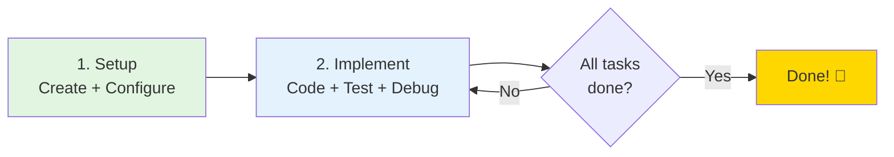

# GitHub Codespaces Quick Start Guide

Welcome to the ML Pipeline Project Codespace! This guide will help you get started in 5 minutes.

## Table of Contents

- [Quick Decision Guide](#quick-decision-guide)
  - [Your Learning Journey](#your-learning-journey)
- [First Time Setup](#first-time-setup)
  - [1. Create Your Codespace](#1-create-your-codespace)
    - [Choosing Your Branch](#choosing-your-branch)
    - [Switching Branches After Creation](#switching-branches-after-creation)
  - [2. Add Your Weights & Biases API Key](#2-add-your-weights--biases-api-key)
  - [3. Verify Setup](#3-verify-setup)
- [Resuming Your Codespace](#resuming-your-codespace)
  - [How to Find Your Codespaces](#how-to-find-your-codespaces)
  - [Understanding Codespace States](#understanding-codespace-states)
  - [Resuming an Active Codespace](#resuming-an-active-codespace)
  - [Restarting a Stopped Codespace](#restarting-a-stopped-codespace)
  - [Managing Multiple Codespaces](#managing-multiple-codespaces)
  - [What Gets Preserved vs Lost](#what-gets-preserved-vs-lost)
  - [Quick Reference Commands](#quick-reference-commands)
- [Terminal Setup](#terminal-setup)
  - [Default Shell](#default-shell)
  - [Conda Environment Auto-Activation](#conda-environment-auto-activation)
  - [Environment Details](#environment-details)
- [Working with the Project](#working-with-the-project)
  - [Project Structure](#project-structure)
  - [Quick Start Workflow](#quick-start-workflow)
    - [Run Pre-Built Steps](#run-pre-built-steps)
    - [Implement Required Components](#implement-required-components)
    - [Run Specific Steps](#run-specific-steps)
    - [Run Full Pipeline (After Implementation)](#run-full-pipeline-after-implementation)
    - [Hyperparameter Optimization](#hyperparameter-optimization)
    - [Test Production Model](#test-production-model)
- [Common Issues](#common-issues)
  - ["WANDB_API_KEY not set"](#wandb_api_key-not-set)
  - ["conda: command not found"](#conda-command-not-found)
  - ["Disk space full"](#disk-space-full)
  - ["Attempted to fetch artifact without alias"](#attempted-to-fetch-artifact-without-alias)
  - ["No module named 'basic_cleaning'"](#no-module-named-basic_cleaning)
  - [Slow execution / timeouts](#slow-execution--timeouts)
  - ["Your local changes would be overwritten by checkout"](#your-local-changes-would-be-overwritten-by-checkout)
  - [Wrong branch / Need to start over](#wrong-branch--need-to-start-over)
- [VS Code Tasks](#vs-code-tasks)
- [Viewing Results](#viewing-results)
  - [MLflow UI](#mlflow-ui)
  - [Weights & Biases](#weights--biases)
- [Jupyter Lab (EDA)](#jupyter-lab-eda)
- [Github Codespaces Limits](#github-codespaces-limits)
  - [Essential Habits](#essential-habits)
  - [Machine Type Recommendations](#machine-type-recommendations)
- [Tips & Best Practices](#tips--best-practices)
  - [Environment Management](#environment-management)
  - [Saving Your Work](#saving-your-work)
  - [Configuration Management](#configuration-management)
  - [Artifact Management Best Practices](#artifact-management-best-practices)
  - [Port Forwarding](#port-forwarding)
- [Getting Help](#getting-help)
  - [Documentation](#documentation)
  - [Common Commands Reference](#common-commands-reference)

## Quick Decision Guide

**Choose your path:**

- **First time here?** → Start with "First Time Setup" below
- **Coming back to your work?** → See "Resuming Your Codespace"
- **Environment not working?** → Jump to "Common Issues"
- **Ready to start coding?** → Go to "Working with the Project"
- **Need help with specific tasks?** → See "Student Implementation Tasks"
- **Running out of credits?** → Check "Free Tier Limits"
- **Want to save your work?** → See "Saving Your Work" in Tips & Best Practices

### Your Learning Journey



**That's it. Three steps:**

1. **Setup** (once, 10 min): Create codespace → Add W&B key → Rebuild
2. **Implement tasks** (repeat): Implement pipeline step → Test → Debug → Iterate
3. **Done**: Complete all pipeline components and run end-to-end

**Pro tip**: One codespace is enough for the entire project. Use git branches to save your work.

---

## First Time Setup

### 1. Create Your Codespace

#### Choosing Your Branch

Before creating your codespace, you need to choose which branch to work from:

**Recommended Options:**

| Branch | When to Use | Best For |
|--------|-------------|----------|
| **`master`** | Starting fresh, following course exercises | Most students - stable, tested infrastructure |
| **`main`** | If this is the default branch | Alternative to master (some repos use main) |
| **Feature branch** | Working on specific improvements or experiments | Advanced users testing new features |


**How to Create:**

1. Navigate to the repository on GitHub
2. **Important**: First select your desired branch using the branch dropdown (top-left, usually shows "main")
3. Click the green **"Code"** button
4. Select the **"Codespaces"** tab
5. Click **"Create codespace on [branch-name]"**
   - The button will show the currently selected branch
   - Double-check this matches your intended branch before clicking

**First-time Setup Time:**
- With prebuild: ~30-60 seconds
- Without prebuild: ~2-3 minutes
- The environment will auto-configure with Python 3.13, conda, MLflow, and W&B

**Pro Tips:**

- **For project work**: Use `main` branch - it has all infrastructure fixes and stable dependencies
- **Switch branches later**: You can change branches inside the codespace without recreating it (saves time and credits)
- **Save your work**: Create your own branch for implementations rather than working directly on main

#### Switching Branches After Creation

You don't need to create a new codespace to work on a different branch. To switch branches in your existing codespace:

**Using VS Code UI:**
1. Click the branch name in the bottom-left status bar
2. Select the branch you want from the dropdown
3. Wait for files to update (a few seconds)

**Using Terminal:**
```bash
git fetch origin                    # Get latest branches
git checkout <branch-name>          # Switch to branch
git checkout main                   # Back to main
git checkout -b my-implementation   # Create new branch
```

**When to switch vs. create new:**

- **Switch branches**: Working on different features, comparing implementations, testing
- **Create new codespace**: Need a completely fresh environment, working on isolated project

### 2. Add Your Weights & Biases API Key

**Important**: This project requires W&B authentication.

1. Get your **v1 API key** from [https://wandb.ai/authorize](https://wandb.ai/authorize)
   - New keys have format: `wandb_v1_...` (86 characters)
   - Legacy 40-character keys are being phased out
2. In GitHub, go to **Settings** → **Codespaces** → **Secrets**
3. Click **New secret**:
   - **Name**: `WANDB_API_KEY`
   - **Value**: [paste your full v1 API key]
   - **Repository access**: Select this repository
4. **Rebuild your Codespace**: Press `Cmd+Shift+P` (Mac) or `Ctrl+Shift+P` (Windows), type "Rebuild Container", and press Enter

**Note:** This repository uses wandb 0.24.0, which supports the new secure v1 API key format.

### 3. Verify Setup

After rebuild, check the terminal output. You should see:
```
✓ WANDB_API_KEY found
✓ W&B login successful!
```

---

## Resuming Your Codespace

After you've created your Codespace and started working, you may need to navigate away from GitHub or close your browser. This section explains how to get back to your work and what to expect when resuming.

### How to Find Your Codespaces

**To access your existing Codespaces:**

1. Go to [GitHub.com](https://github.com)
2. Click on your **profile picture** (top-right corner)
3. Select **"Your codespaces"** from the dropdown menu
   - Or navigate directly to: `https://github.com/codespaces`
4. You'll see a list of all your Codespaces with their status

**Alternative access method:**
- From any repository, click the green **"Code"** button → **"Codespaces"** tab
- Shows Codespaces for that repository only

### Understanding Codespace States

Your Codespace can be in one of two states:

| State | Description | Resource Usage | Visual Indicator |
|-------|-------------|----------------|------------------|
| **Active** | Currently running and ready to use | Consuming core-hours | 🟢 Green dot |
| **Stopped** | Paused, not running | No core-hours consumed | ⚫ Gray dot |

**Important**: Active Codespaces consume your monthly core-hour quota even when you're not actively using them. Always stop Codespaces when taking breaks!

### Resuming an Active Codespace

If your Codespace is still running (Active state):

1. Click on the **Codespace name** from the list
2. Your browser opens a new tab/window
3. Codespace loads within 2-3 seconds
4. **Everything is preserved**:
   - Terminal history and command state
   - Running processes (MLflow UI, Jupyter servers)
   - Uncommitted file changes
   - Conda environment activation
   - W&B authentication

**Pro tip**: Bookmark your Codespace URL for instant access!

### Restarting a Stopped Codespace

If your Codespace has been stopped (either manually or by auto-timeout):

1. Find the stopped Codespace in your list
2. Click the **three-dot menu (...)** next to the Codespace name
3. Select **"Open in browser"** (or click the Codespace name)
4. Wait 10-15 seconds for restart
5. The `postStartCommand` runs automatically (activates conda, checks W&B)

**What's preserved after stop:**
- ✅ All file changes (committed or uncommitted)
- ✅ Conda environments you created
- ✅ W&B authentication
- ✅ Git branches and repository state
- ✅ VS Code settings and extensions

**What's NOT preserved:**
- ❌ Running processes (MLflow UI, Jupyter servers)
- ❌ Terminal history and state
- ❌ Port forwarding sessions

**After restart, you may need to:**
```bash
# Verify conda environment is active
conda info --envs

# Restart MLflow UI if you were using it
mlflow ui

# Restart Jupyter Lab if you were using it
mlflow run src/eda
```

### Managing Multiple Codespaces

**Best Practice**: Use one Codespace and switch git branches instead of creating multiple Codespaces.

**Why?**
- Saves core-hours (only one running instance)
- Faster than creating new Codespace each time
- Easier to manage and track work

**How to manage:**

```bash
# Switch between branches in your Codespace
git checkout main
git checkout -b feature-branch
git checkout exercise-2

# View all branches
git branch -a
```

**Stopping unused Codespaces:**
1. Go to your Codespaces list
2. Click three-dot menu (...) → **"Stop codespace"**
3. Codespace enters Stopped state (preserves work, stops billing)

**Deleting old Codespaces:**
1. Click three-dot menu (...) → **"Delete"**
2. Confirm deletion
3. **Warning**: All uncommitted changes are permanently lost!
4. **Always commit and push your work before deleting!**

### What Gets Preserved vs Lost

Understanding what persists helps you work confidently:

| Item | After Stop | After Delete | Notes |
|------|------------|--------------|-------|
| Committed code | ✅ Preserved | ❌ Lost locally | Safe if pushed to GitHub |
| Uncommitted changes | ✅ Preserved | ❌ Lost forever | Commit before deleting! |
| Conda environments | ✅ Preserved | ❌ Lost | Easy to recreate from YAML |
| W&B authentication | ✅ Preserved | ❌ Lost | Re-authenticates on new Codespace |
| Running processes | ❌ Lost | ❌ Lost | Restart MLflow, Jupyter manually |
| Terminal history | ❌ Lost | ❌ Lost | Use git log for command reference |
| MLflow experiments | ✅ In W&B | ✅ In W&B | Stored in cloud, always safe |
| W&B artifacts | ✅ In W&B | ✅ In W&B | Stored in cloud, always safe |

**Golden Rule**: Commit and push your work frequently. If it's not in GitHub or W&B, it can be lost!

### Quick Reference Commands

After resuming a Codespace, use these commands to verify your environment:

```bash
# Check active conda environment (should show nyc_airbnb_dev)
conda info --envs

# Verify Python and key packages
python --version
mlflow --version
wandb --version

# Check W&B authentication
wandb whoami

# Re-authenticate W&B if needed
wandb login

# Check git status
git status
git branch

# Check disk space
df -h /workspaces

# Restart MLflow UI (if you were using it)
mlflow ui --host 0.0.0.0 &

# View running processes
ps aux | grep python
```

**Quick troubleshooting:**
- **Environment not activated?** → `conda activate nyc_airbnb_dev`
- **W&B not authenticated?** → `wandb login` (uses your GitHub Codespaces secret)
- **Port forwarding not working?** → Check "Ports" tab in VS Code, restart process

---

## Terminal Setup

### Default Shell
This Codespace uses **Zsh** as the default shell with Oh My Zsh for enhanced functionality.

### Conda Environment Auto-Activation
The `nyc_airbnb_dev` conda environment is configured to auto-activate in new terminals.

**What you'll see when opening a new terminal:**
```
==========================================
  NYC Airbnb ML Pipeline - Codespace
==========================================

Environment: Python 3.13, MLflow 3.3.2
Disk Space: XXG available

Quick Start:
  mlflow run . -P steps=download
  mlflow run . -P steps=basic_cleaning
  mlflow run .

Docs: README.md | CODESPACES_QUICKSTART.md
```

**Verify your environment:**
```bash
# Check active environment (should show * next to nyc_airbnb_dev)
conda env list

# Verify Python version (should be 3.13)
python --version

# Verify MLflow version (should be 3.3.2)
mlflow --version
```

**If auto-activation doesn't work:**
Manually activate the environment in each new terminal:
```bash
conda activate nyc_airbnb_dev
```

### Environment Details

- **Name**: `nyc_airbnb_dev`
- **Python**: 3.13
- **Key Packages**: MLflow 3.3.2, W&B 0.24.0, pandas 2.3.2, scikit-learn 1.7.2
- **Location**: `/opt/conda/envs/nyc_airbnb_dev`

---

## Working with the Project

### Project Structure

This is an MLflow-based ML pipeline for predicting NYC short-term rental prices. The pipeline has 6 main steps:

1. **download** - Fetches raw data sample (pre-built component)
2. **basic_cleaning** - Removes outliers, handles dates (**student implements**)
3. **data_check** - pytest-based data validation (**student completes**)
4. **data_split** - Segregates test set (pre-built component)
5. **train_random_forest** - Trains RF model (**student completes**)
6. **test_regression_model** - Tests production model (pre-built component)

### Quick Start Workflow

#### Run Pre-Built Steps
```bash
# Download data (works immediately)
mlflow run . -P steps=download
```

#### Implement Required Components

**⚠️ IMPORTANT:** Before running the full pipeline, you must complete the student implementation tasks!

See "Student Implementation Tasks" section below for detailed instructions.

#### Run Specific Steps
```bash
# Single step
mlflow run . -P steps=download

# Multiple steps
mlflow run . -P steps=download,basic_cleaning

# Override config parameters using Hydra syntax
mlflow run . \
  -P steps=train_random_forest \
  -P hydra_options="modeling.random_forest.n_estimators=100 etl.min_price=50"
```

#### Run Full Pipeline (After Implementation)
```bash
# Execute all steps end-to-end
mlflow run .
```

#### Hyperparameter Optimization
```bash
# Multi-run with Hydra (-m flag)
mlflow run . \
  -P steps=train_random_forest \
  -P hydra_options="modeling.max_tfidf_features=10,15,30 modeling.random_forest.max_features=0.1,0.33,0.5 -m"
```

#### Test Production Model
```bash
# Must manually tag a model as "prod" in W&B first
mlflow run . -P steps=test_regression_model
```

---

## Common Issues

### "WANDB_API_KEY not set"
**Problem**: W&B authentication failed
**Solution**:
1. Check if you added the secret to GitHub Codespaces (Settings → Codespaces → Secrets)
2. Make sure the secret name is exactly `WANDB_API_KEY`
3. Rebuild your container (`Cmd+Shift+P` → "Rebuild Container")

### "conda: command not found"
**Problem**: Conda not activated or initialized

**Note**: As of this setup, conda is automatically initialized for both bash and zsh shells. The `nyc_airbnb_dev` environment is also configured to auto-activate when you open a new terminal. You should not need to manually run `conda init` or source the conda script.

**Solution**: If you still encounter this error, try these steps:

1. **Open a fresh terminal** (the initialization runs on new terminal sessions)
2. **If that doesn't work**, manually activate:
   ```bash
   source /opt/conda/etc/profile.d/conda.sh
   conda activate nyc_airbnb_dev
   ```
3. **If conda is truly not initialized**, run (one-time only):
   ```bash
   conda init $(basename "$SHELL")
   ```
   Then close and reopen your terminal.

### "Disk space full"
**Problem**: Too many conda environments created by MLflow
**Solution**: Run the cleanup script:
```bash
bash .devcontainer/scripts/cleanup-mlflow-envs.sh
```
Or use the VS Code task: `Cmd+Shift+P` → "Tasks: Run Task" → "Cleanup MLflow Environments"

### "Attempted to fetch artifact without alias"
**Problem**: Missing version tag on artifact reference
**Solution**: Always specify artifact versions/tags:
- Use `:latest` or `:reference` or `:prod` tag
- Example: `sample.csv:latest` NOT `sample.csv`

### "No module named 'basic_cleaning'"
**Problem**: Haven't created the basic_cleaning directory yet
**Solution**: Follow Task 1 in "Student Implementation Tasks" to create the component with cookiecutter

### Slow execution / timeouts

**Problem**: Codespace resource constraints or first-run environment creation
**Solution**:

- **First run**: MLflow creates conda environments for each step (~5 minutes total). Subsequent runs reuse environments (~30 seconds)
- **Resource constraints**:
  - Close unused browser tabs
  - Stop unnecessary processes
  - Upgrade to 4-core machine for hyperparameter sweeps (Codespace menu → "Change machine type")
- See "Free Tier Limits" section for machine type recommendations

### "Your local changes would be overwritten by checkout"

**Problem**: Trying to switch branches with uncommitted changes
**Solution**:

```bash
# Option 1: Save your work (recommended)
git add .
git commit -m "Work in progress on basic_cleaning"
git checkout <target-branch>

# Option 2: Stash changes temporarily
git stash
git checkout <target-branch>
# Later, return and restore:
git checkout <original-branch>
git stash pop

# Option 3: Discard changes (use with caution!)
git checkout -- .
git checkout <target-branch>
```

### Wrong branch / Need to start over

**Problem**: Created codespace on wrong branch or environment is corrupted
**Solution**:

```bash
# Check current branch
git branch

# Switch to correct branch
git checkout main

# If environment is corrupted, recreate it
conda env remove --name nyc_airbnb_dev
conda env create -f environment.yml
conda activate nyc_airbnb_dev
```

Or simply delete the codespace and create a new one from the correct branch.

---

## VS Code Tasks

Access via `Cmd+Shift+P` → "Tasks: Run Task":

- **Cleanup MLflow Environments**: Free up disk space
- **Run MLflow Project**: Run `mlflow run .` (default task)
- **Run Specific Step**: Run individual pipeline steps
- **Start Jupyter Lab**: Launch Jupyter for EDA

---

## Viewing Results

### MLflow UI
When you run `mlflow run .`, the MLflow UI becomes available:
1. Check the "Ports" tab in VS Code (bottom panel)
2. Click on the "MLflow UI" link (port 5000)
3. View experiments, parameters, metrics, and artifacts

### Weights & Biases
1. Go to [https://wandb.ai](https://wandb.ai)
2. Navigate to your project (e.g., `nyc_airbnb`)
3. View runs, artifacts, and visualizations
4. Tag best model as "prod" for production testing

---

## Jupyter Lab (EDA)

The project includes an EDA component for exploratory data analysis:

```bash
mlflow run src/eda
```

When Jupyter opens:
1. Check the "Ports" tab in VS Code
2. Click on the Jupyter Lab link (port 8888)
3. Create new notebook or open existing analysis

**IMPORTANT**: Properly shut down Jupyter:
1. Save your work
2. File → Shut Down
3. Close browser tab
4. Kill terminal process (Ctrl+C)

**Never** just close the browser tab - this leaves Jupyter running and consuming resources.

---

## Github Codespaces Limits

**What you get:**

- **60 core-hours/month** (free accounts)
- **180 core-hours/month** (with GitHub Student Developer Pack - get this!)

### Essential Habits

**To make your credits last:**

- **Stop when done**: Click Codespace name → "Stop codespace" (don't leave it running)
- **Auto-stop**: Set timeout to 30 minutes (GitHub Settings → Codespaces)
- **Delete old codespaces**: Keep only your active one
- **Use 2-core machine**: Sufficient for most development work
- **Upgrade to 4-core only for hyperparameter sweeps**: Switch back to 2-core after
- **One codespace, many branches**: Switch branches instead of creating multiple codespaces

### Machine Type Recommendations

| Task | Recommended Cores | Duration |
|------|------------------|----------|
| Development & debugging | 2-core | Most of the time |
| Testing pipeline steps | 2-core | Quick iterations |
| Hyperparameter sweeps | 4-core | Only when needed |
| Multiple parallel runs | 8-core | Rare, time-boxed |

**Credit calculation examples:**
- 2-core for 15 hours = 30 core-hours ✅ Well within free tier
- 4-core for 3 hours = 12 core-hours ✅ For occasional sweeps
- 8-core for 1 hour = 8 core-hours ⚠️ Use sparingly

---

## Tips & Best Practices

### Environment Management
- Main environment: `nyc_airbnb_dev` (manually managed)
- MLflow creates temporary environments for each step automatically
- List all environments: `conda info --envs`
- Clean up MLflow environments: Use cleanup script (see Common Issues)

### Saving Your Work

**Important**: Changes you make in the codespace are not automatically saved to your GitHub account.

**Recommended workflow for saving your implementations:**

1. **Create your own branch for your work:**
   ```bash
   git checkout -b my-implementation
   # Work on tasks
   git add .
   git commit -m "Implemented basic_cleaning component"
   git push origin my-implementation
   ```

2. **Fork the repository first (recommended for students):**
   - Fork the repository to your own GitHub account
   - Create codespace from YOUR fork
   - Create branches for different features
   - Push your work to your fork (preserves all your solutions)

3. **Commit frequently:**
   ```bash
   # After implementing a component
   git add src/basic_cleaning/
   git commit -m "Add basic_cleaning component"

   # After completing a task
   git add main.py
   git commit -m "Complete pipeline orchestration in main.py"

   # Push to your fork
   git push origin my-implementation
   ```

**What gets saved vs. lost:**

- ✅ **Saved**: Code you commit and push to a branch
- ✅ **Saved**: W&B artifacts (stored in cloud)
- ❌ **Lost**: Uncommitted code changes when codespace is deleted
- ❌ **Lost**: Local conda environments (need to recreate)
- ❌ **Lost**: Terminal history and running processes

### Configuration Management

**Always use config.yaml** for parameters:
- Never hardcode values in your code
- Access in `main.py` via: `config["section"]["parameter"]`
- Override at runtime with Hydra: `-P hydra_options="etl.min_price=50"`

### Artifact Management Best Practices

**Critical**: Always specify artifact versions/tags:
- ✅ `sample.csv:latest`
- ✅ `clean_sample.csv:reference`
- ✅ `random_forest_export:prod`
- ❌ `sample.csv` (will fail!)

### Port Forwarding
VS Code automatically forwards these ports:
- **5000**: MLflow UI (access via Ports tab)
- **8888**: Jupyter Lab (auto-opens in browser)

---

## Getting Help

### Documentation
- **This file**: Quick start for Codespaces
- **README.md**: Full repository documentation
- **config.yaml**: All configurable parameters

### Common Commands Reference
```bash
# Navigate
cd src/<component-name>
cd src/train_random_forest

# Environment
conda activate nyc_airbnb_dev
conda info --envs
conda env create -f environment.yml

# Run pipeline
mlflow run .
mlflow run . -P steps=download
mlflow run . -P steps=download,basic_cleaning
mlflow run . -P hydra_options="param=value"

# Create new component
cookiecutter cookie-mlflow-step -o src

# W&B
wandb login
wandb whoami
wandb status

# Cleanup
bash .devcontainer/scripts/cleanup-mlflow-envs.sh
```

Happy building!