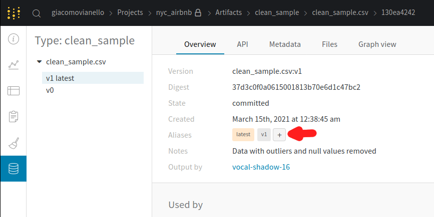
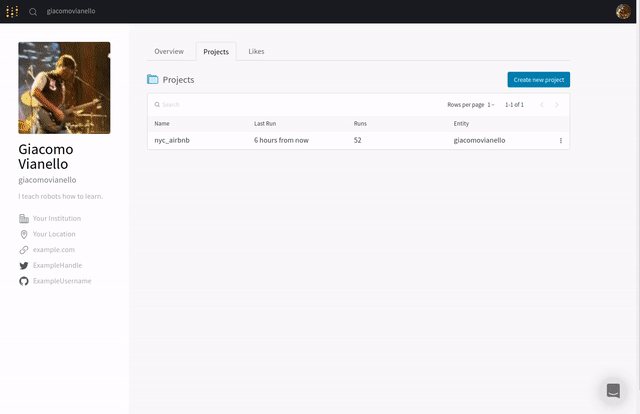
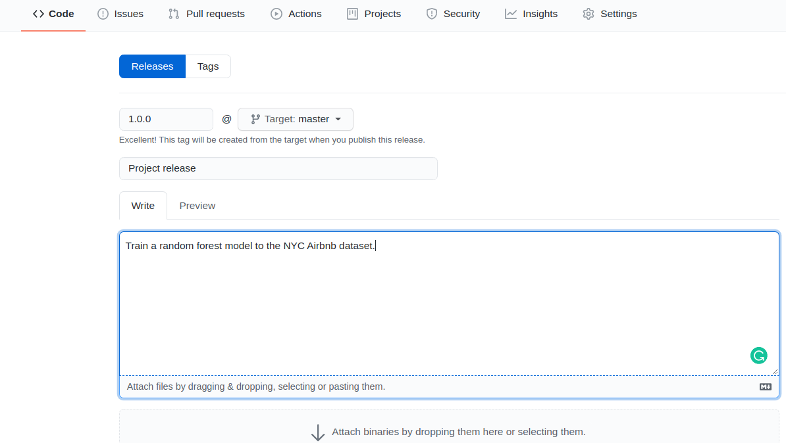

# Build an ML Pipeline for Short-Term Rental Prices in NYC
You are working for a property management company renting rooms and properties for short periods of 
time on various rental platforms. You need to estimate the typical price for a given property based 
on the price of similar properties. Your company receives new data in bulk every week. The model needs 
to be retrained with the same cadence, necessitating an end-to-end pipeline that can be reused.

In this project you will build such a pipeline.

## Table of contents

- [Introduction](#build-an-ML-Pipeline-for-Short-Term-Rental-Prices-in-NYC)
- [Preliminary steps](#preliminary-steps)
  * [Choose where to work](#choose-where-to-work)
  * [Create your repository](#create-your-repository)
  * [Create environment](#create-environment)
  * [Get API key for Weights and Biases](#get-api-key-for-weights-and-biases)
  * [Cookie cutter](#cookie-cutter)
  * [The configuration](#the-configuration)
  * [Running the entire pipeline or just a selection of steps](#Running-the-entire-pipeline-or-just-a-selection-of-steps)
  * [Pre-existing components](#pre-existing-components)
- [Instructions](#instructions)
  * [Exploratory Data Analysis (EDA)](#exploratory-data-analysis-eda)
  * [Data cleaning](#data-cleaning)
  * [Data testing](#data-testing)
  * [Data splitting](#data-splitting)
  * [Train Random Forest](#train-random-forest)
  * [Optimize hyperparameters](#optimize-hyperparameters)
  * [Select the best model](#select-the-best-model)
  * [Test](#test)
  * [Visualize the pipeline](#visualize-the-pipeline)
  * [Release the pipeline](#release-the-pipeline)
  * [Train the model on a new data sample](#train-the-model-on-a-new-data-sample)
- [Submission](#submission)
- [In case of errors](#in-case-of-errors)

## Preliminary steps

### Supported Operating Systems

This project is compatible with the following operating systems:

- **Ubuntu 22.04** (Jammy Jellyfish) - both Ubuntu installation and WSL (Windows Subsystem for Linux)
- **Ubuntu 24.04** - both Ubuntu installation and WSL (Windows Subsystem for Linux)
- **macOS** - compatible with recent macOS versions

Please ensure you are using one of the supported OS versions to avoid compatibility issues.

### Python requirement

The development environment and pipeline components use **Python 3.13**. The EDA component has its own
environment in `src/eda/conda.yml` and intentionally uses Python 3.12, which is compatible with its profiling
dependencies. Do not change environment versions merely to make every file use the same Python version.

### Choose where to work

You can complete the project in the classroom Workspace or in a local clone:

- **Classroom Workspace:** open the repository in the Workspace, choose the preinstalled `ml` notebook kernel,
  and confirm that it reports Python 3.13.x. The Workspace environment is already prepared; do not recreate it
  from `environment.yml`.
- **Local computer:** create and clone your selected source repository, install conda, and create the development
  environment as described below. Run commands from the repository root unless a step says otherwise.

Both routes produce the same repository artifacts. In particular, save the EDA notebook as `EDA.ipynb` in the
repository root and use [`notes.md`](notes.md) as its completion checklist.

### Create your repository

Choose GitHub or Azure Repos for your project source repository. This choice is independent of whether you work in
the classroom Workspace or on your local computer.

For GitHub, open the
[official public starter repository](https://github.com/udacity/build-ml-pipeline-for-short-term-rental-prices.git)
and click **Fork**. Then clone your fork:

```bash
git clone https://github.com/<your-github-username>/build-ml-pipeline-for-short-term-rental-prices.git
```

For Azure Repos, use **Import repository** to import the same official public starter URL:

```text
https://github.com/udacity/build-ml-pipeline-for-short-term-rental-prices.git
```

Then copy the clone URL from your imported Azure repository and clone that repository:

```bash
git clone <your-azure-repos-clone-url> build-ml-pipeline-for-short-term-rental-prices
```

Use your platform's normal Git authentication flow. Do not embed a personal access token, password, or other secret
in the repository URL. Enter the cloned repository:

```bash
cd build-ml-pipeline-for-short-term-rental-prices
```

Commit and push to your selected source repository often while you make progress towards the solution. Remember
to add meaningful commit messages.

### Create environment

For local work, make sure conda is installed, then create and activate the development environment from the
repository root:

```bash
conda env create -f environment.yml
conda activate nyc_airbnb_dev
```

The environment files have different roles:

- `environment.yml` creates `nyc_airbnb_dev`, the environment used to edit the project and invoke MLflow.
- The root `conda.yml` is the environment MLflow uses for the top-level pipeline when you run `mlflow run .`.
- Each component has its own `conda.yml`. MLflow creates that component environment when the step runs. For
  example, `src/eda/conda.yml` stays with the EDA component even though its notebook is saved at the repository root.

Keep these environments separate. Existing version pins reflect the compatibility of each component and should
only be changed to solve a reproduced dependency problem.

The project should keep this root-level structure as you work:

```text
.
├── README.md
├── notes.md
├── config.yaml
├── environment.yml
├── conda.yml
├── MLproject
├── main.py
├── EDA.ipynb                  # created during the EDA
├── components/               # reusable components supplied by the starter
└── src/
    ├── basic_cleaning/        # provided scaffold; complete its TODOs
    ├── data_check/
    ├── eda/
    └── train_random_forest/
```

### Get API key for Weights and Biases
Let's make sure we are logged in to Weights & Biases. Get your API key from W&B by going to 
[https://wandb.ai/authorize](https://wandb.ai/authorize) and click on the + icon (copy to clipboard), 
then paste your key into this command:

```bash
> wandb login [your API key]
```

You should see a message similar to:
```
wandb: Appending key for api.wandb.ai to your netrc file: /home/[your username]/.netrc
```

### Cookie cutter
In order to make your job a little easier, you are provided a cookie cutter template that you can use to create 
stubs for new pipeline components. It is not required that you use this, but it might save you from a bit of 
boilerplate code. Just run the cookiecutter and enter the required information, and a new component 
will be created including the `conda.yml` file, the `MLproject` file as well as the script. You can then modify these
as needed, instead of starting from scratch.
For example, this creates a separate practice component:

```bash
cookiecutter cookie-mlflow-step -o src

step_name [step_name]: example_step
script_name [run.py]: run.py
job_type [my_step]: example_step
short_description [My step]: Practice MLflow step
long_description [An example of a step using MLflow and Weights & Biases]: Practice component generated from the template
parameters [parameter1,parameter2]: input_artifact,output_artifact
```

This creates the following structure:

```bash
ls src/example_step/
conda.yml  MLproject  run.py
```

You can now modify the script (``run.py``), the conda environment (``conda.yml``) and the project definition 
(``MLproject``) as you please.

The generated script receives `input_artifact` and `output_artifact` and can be called like:

```bash
mlflow run src/example_step -P input_artifact="input:latest" -P output_artifact="output"
```

The starter already includes `src/basic_cleaning`. Reuse it for the project. Generate that directory from the
template only if it is genuinely absent from your starter; do not generate over the provided scaffold.

### The configuration
As usual, the parameters controlling the pipeline are defined in the ``config.yaml`` file defined in
the root of the starter kit. We will use Hydra to manage this configuration file. 
Open this file and get familiar with its content. Remember: this file is only read by the ``main.py`` script 
(i.e., the pipeline) and its content is
available with the ``go`` function in ``main.py`` as the ``config`` dictionary. For example,
the name of the project is contained in the ``project_name`` key under the ``main`` section in
the configuration file. It can be accessed from the ``go`` function as 
``config["main"]["project_name"]``.

NOTE: do NOT hardcode any parameter when writing the pipeline. All the parameters should be 
accessed from the configuration file.

### Running the entire pipeline or just a selection of steps
In order to run the pipeline when you are developing, you need to be in the root of the starter kit, 
then you can execute as usual:

```bash
mlflow run .
```
This selects every default step. In the starter, only the download call is implemented; later branches still contain
student TODOs and may simply execute `pass`. A zero exit status therefore does not mean that the pipeline is complete.
After implementing each step, verify its expected W&B artifacts, tests, and metrics.

When developing it is useful to be able to run one step at the time. Say you want to run only
the ``download`` step. The `main.py` is written so that the steps are defined at the top of the file, in the 
``_steps`` list, and can be selected by using the `steps` parameter on the command line:

```bash
mlflow run . -P steps=download
```
If you want to run the ``download`` and the ``basic_cleaning`` steps, you can similarly do:
```bash
mlflow run . -P steps=download,basic_cleaning
```
You can override any other parameter in the configuration file using the Hydra syntax, by
providing it as a ``hydra_options`` parameter. For example, say that we want to set the parameter
modeling -> random_forest -> n_estimators to 10 and etl->min_price to 50:

```bash
mlflow run . \
  -P steps=download,basic_cleaning \
  -P hydra_options="modeling.random_forest.n_estimators=10 etl.min_price=50"
```

### Pre-existing components
In order to simulate a real-world situation, we are providing you with some pre-implemented
reusable components under the repository's `components` directory. `config.yaml` sets
`main.components_repository` to `components`, so MLflow resolves these components locally from your clone. The
implemented download step is an example:

```python
_ = mlflow.run(
                f"{config['main']['components_repository']}/get_data",
                "main",
                env_manager="conda",
                parameters={
                    "sample": config["etl"]["sample"],
                    "artifact_name": "sample.csv",
                    "artifact_type": "raw_data",
                    "artifact_description": "Raw file as downloaded"
                },
            )
```
You can see the parameters they require in their local `MLproject` files:

- `get_data`: downloads the data. [MLproject](components/get_data/MLproject)
- `train_val_test_split`: segregates the data into splits. [MLproject](components/train_val_test_split/MLproject)


## Instructions

The pipeline is defined in the ``main.py`` file in the root of the starter kit. The file already
contains some boilerplate code as well as the download step. Your task will be to develop the
needed additional step, and then add them to the ``main.py`` file.

__*NOTE*__: the modeling in this exercise should be considered a baseline. We kept the data cleaning and the modeling 
simple because we want to focus on the MLops aspect of the analysis. It is possible with a little more effort to get
a significantly-better model for this dataset.

### Exploratory Data Analysis (EDA)
The scope of this section is to get an idea of how the process of an EDA works in the context of
pipelines, during the data exploration phase. In a real scenario you would spend a lot more time
in this phase, but here we are going to do the bare minimum.

NOTE: remember to add some markdown cells explaining what you are about to do, so that the
notebook can be understood by other people like your colleagues

1. The ``main.py`` script already comes with the download step implemented. Run the pipeline to 
   get a sample of the data. Run this command from the repository root. The pipeline will also upload it to
   Weights & Biases:
   
  ```bash
  mlflow run . -P steps=download
  ```
  
  You will see a message similar to:

  ```
  2021-03-12 15:44:39,840 Uploading sample.csv to Weights & Biases
  ```
  This tells you that the data is going to be stored in W&B as the artifact named ``sample.csv``.

2. Now execute the `eda` step:
   ```bash
   mlflow run src/eda
   ```
   MLflow creates the environment defined in `src/eda/conda.yml`, then opens JupyterLab with the repository root as
   its file browser. Create a notebook with the Python kernel supplied by this EDA environment and save it as
   `EDA.ipynb` in the repository root. If you are working directly in the classroom Workspace instead, use its
   preinstalled `ml` kernel and save the notebook at the same path.
3. Within the notebook, fetch the artifact we just created (``sample.csv``) from W&B and read 
   it with pandas:
    
    ```python
    import wandb
    import pandas as pd
    
    run = wandb.init(project="nyc_airbnb", group="eda", save_code=True)
    local_path = wandb.use_artifact("sample.csv:latest").file()
    df = pd.read_csv(local_path)
    ```
    Note that we use ``save_code=True`` in the call to ``wandb.init`` so the notebook is uploaded and versioned
    by W&B.

4. Using `ydata-profiling`, create a profile:
   ```python
   from ydata_profiling import ProfileReport

   profile = ProfileReport(df)
   profile.to_notebook_iframe()
   ```
   what do you notice? Look around and see what you can find. 
   
   For example, there are missing values in a few columns and the column `last_review` is a 
   date but it is in string format. Look also at the `price` column, and note the outliers. There are some zeros and 
   some very high prices. After talking to your stakeholders, you decide to consider from a minimum of $ 10 to a 
   maximum of $ 350 per night.
   
5. Fix some of the little problems we have found in the data with the following code:
    
   ```python
   # Drop outliers
   min_price = 10
   max_price = 350
   idx = df['price'].between(min_price, max_price)
   df = df[idx].copy()
   # Convert last_review to datetime
   df['last_review'] = pd.to_datetime(df['last_review'])
   ```
   Note how we did not impute missing values. We will do that in the inference pipeline, so we will be able to handle
   missing values also in production.
6. Create a new profile or check with ``df.info()`` that all obvious problems have been solved
7. Terminate the run by running `run.finish()`
8. Follow the final checks in [`notes.md`](notes.md): restart the kernel, run all cells from top to bottom, and save
   `EDA.ipynb`. In JupyterLab, shut down the notebook kernel, then use **File -> Shut Down** to stop the Jupyter
   server. When the server exits, the `mlflow run src/eda` command also finishes.

## Data cleaning

Now we transfer the data processing we have done as part of the EDA to a new ``basic_cleaning`` 
step that starts from the ``sample.csv`` artifact and create a new artifact ``clean_sample.csv`` 
with the cleaned data:

1. The starter kit provides a stub in `src/basic_cleaning`. Reuse that directory; do not run Cookiecutter over it.
   If the directory is missing from an older starter, use the setup example above to generate it once with the name
   `basic_cleaning` and the comma-separated parameter names listed below. The step should accept the parameters
   ``input_artifact``
   (the input artifact), ``output_artifact`` (the name for the output artifact), 
   ``output_type`` (the type for the output artifact), ``output_description`` 
   (a description for the output artifact), ``min_price`` (the minimum price to consider)
   and ``max_price`` (the maximum price to consider). The provided directory contains `conda.yml`, `MLproject`, and
   `run.py`; its TODO markers are part of the exercise.
   
2. Modify the ``src/basic_cleaning/run.py`` script and the ML project script by filling the 
   missing information about parameters (note the 
   comments like ``INSERT TYPE HERE`` and ``INSERT DESCRIPTION HERE``). All parameters should be
   of type ``str`` except ``min_price`` and ``max_price`` that should be ``float``.
   
3. Implement in the section marked ```# YOUR CODE HERE     #``` the steps we 
   have implemented in the notebook, including downloading the data from W&B. 
   Remember to use the ``logger`` instance already provided to print meaningful messages to screen. 
   
   Make sure to use ``args.min_price`` and ``args.max_price`` when dropping the outliers 
   (instead of  hard-coding the values like we did in the notebook).
   Save the results to a CSV file called ``clean_sample.csv`` 
   (``df.to_csv("clean_sample.csv", index=False)``)
   **_NOTE_**: Remember to use ``index=False`` when saving to CSV, otherwise the data checks in
               the next step might fail because there will be an extra ``index`` column
   
   Then upload it to W&B using:
   
   ```python
   artifact = wandb.Artifact(
        args.output_artifact,
        type=args.output_type,
        description=args.output_description,
    )
    artifact.add_file("clean_sample.csv")
    run.log_artifact(artifact)
   ```
   
   **_REMEMBER__**: A component must declare every library it imports. When you add the pandas import for your
   cleaning implementation, add a compatible version pin such as `pandas=2.3.2` to
   `src/basic_cleaning/conda.yml`. Preserve the scaffold's existing Python, MLflow, and W&B dependencies.
   
4. Add the ``basic_cleaning`` step to the pipeline (the ``main.py`` file):

   **_WARNING:_**: please note how the path to the step is constructed: 
                   ``os.path.join(hydra.utils.get_original_cwd(), "src", "basic_cleaning")``.
   This is necessary because Hydra executes the script in a different directory than the root
   of the starter kit. You will have to do the same for every step you are going to add to the 
   pipeline.
   
   **_NOTE_**: Remember that when you refer to an artifact stored on W&B, you MUST specify a
               version or alias. For example, here the ``input_artifact`` should be
               ``sample.csv:latest`` and NOT just ``sample.csv``. If you forget to do this, 
               you will see a message like
               ``Attempted to fetch artifact without alias (e.g. "<artifact_name>:v3" or "<artifact_name>:latest")``

   ```python
   if "basic_cleaning" in active_steps:
       _ = mlflow.run(
            os.path.join(hydra.utils.get_original_cwd(), "src", "basic_cleaning"),
            "main",
            parameters={
                "input_artifact": "sample.csv:latest",
                "output_artifact": "clean_sample.csv",
                "output_type": "clean_sample",
                "output_description": "Data with outliers and null values removed",
                "min_price": config['etl']['min_price'],
                "max_price": config['etl']['max_price']
            },
        )
   ```
5. Run the pipeline. If you go to W&B, you will see the new artifact type `clean_sample` and within it the 
   `clean_sample.csv` artifact

### Data testing
After the cleaning, it is a good practice to put some tests that verify that the data does not
contain surprises. 

One of our tests will compare the distribution of the current data sample with a reference, 
to ensure that there is no unexpected change. Therefore, we first need to define a 
"reference dataset". We will add the ``reference`` alias to the latest ``clean_sample.csv`` artifact version as our
reference dataset. Go with your browser to ``wandb.ai``, navigate to your `nyc_airbnb` project, then to the
artifact tab. Open the ``clean_sample`` artifact type, select the ``clean_sample.csv`` artifact, then select its
version with the ``latest`` alias. This is the last one we produced in the previous step. Add the ``reference``
version alias by clicking the "+" in the Aliases section on the right:


 
Now we are ready to add some tests. In the starter kit you can find a ``data_check`` step
that you need to complete. Let's start by appending to 
``src/data_check/test_data.py`` the following test:
  
```python
def test_row_count(data):
    assert 15000 < data.shape[0] < 1000000
```
which checks that the size of the dataset is reasonable (not too small, not too large).

Then, add another test ``test_price_range(data, min_price, max_price)`` that checks that 
the price range is between ``min_price`` and ``max_price`` 
(hint: you can use the ``data['price'].between(...)`` method). Also, remember that we are using closures, so the
name of the variables that your test takes in MUST BE exactly `data`, `min_price` and `max_price`.

Now add the `data_check` component to the main file, so that it gets executed as part of our
pipeline. Use ``clean_sample.csv:latest`` as ``csv`` and ``clean_sample.csv:reference`` as 
``ref``. Right now they point to the same file, but later on they will not: we will fetch another sample of data
and therefore the `latest` alias will point to that.
Also, use the configuration for the other parameters. For example, 
use ``config["data_check"]["kl_threshold"]`` for the ``kl_threshold`` parameter. 

Then run the pipeline and make sure the tests are executed and that they pass. Remember that you can run just this
step with:

```bash
> mlflow run . -P steps="data_check"
```


### Data splitting
Use the provided component called ``train_val_test_split`` to extract and segregate the test set. 
Add it to the pipeline then run the pipeline. As usual, use the configuration for the parameters like `test_size`,
`random_seed` and `stratify_by`. Look at the `modeling` section in the config file.

**_HINT_**: The path to the step can
be expressed as ``mlflow.run(f"{config['main']['components_repository']}/train_val_test_split", ...)``.

You can see the parameters accepted by this step [here](https://github.com/udacity/build-ml-pipeline-for-short-term-rental-prices/blob/main/components/train_val_test_split/MLproject)

After you execute, you will see something like:

```
2021-03-15 01:36:44,818 Uploading trainval_data.csv dataset
2021-03-15 01:36:47,958 Uploading test_data.csv dataset
```
in the log. This tells you that the script is uploading 2 new datasets: ``trainval_data.csv`` and ``test_data.csv``.

### Train Random Forest
Complete the script ``src/train_random_forest/run.py``. All the places where you need to insert code are marked by
a `# YOUR CODE HERE` comment and are delimited by two signs like `######################################`. You can
find further instructions in the file.

Once you are done, add the step to ``main.py``. Use the name ``random_forest_export`` as ``output_artifact``.

**_NOTE_**: the main.py file already provides a variable ``rf_config`` to be passed as the
            ``rf_config`` parameter.

### Optimize hyperparameters
Re-run the entire pipeline varying the hyperparameters of the Random Forest model. This can be
accomplished easily by exploiting the Hydra configuration system. Use the multi-run feature (adding the `-m` option 
at the end of the `hydra_options` specification), and try setting the parameter `modeling.max_tfidf_features` to 10, 15
and 30, and the `modeling.random_forest.max_features` to 0.1, 0.33, 0.5, 0.75, 1.

HINT: if you don't remember the hydra syntax, you can take inspiration from this is example, where we vary 
two other parameters (this is NOT the solution to this step):
```bash
> mlflow run . \
  -P steps=train_random_forest \
  -P hydra_options="modeling.random_forest.max_depth=10,50,100 modeling.random_forest.n_estimators=100,200,500 -m"
```
you can change this command line to accomplish your task.

While running this simple experimentation is enough to complete this project, you can also explore more and see if 
you can improve the performance. You can also look at the Hydra documentation for even more ways to do hyperparameters 
optimization. Hydra is very powerful, and allows even to use things like Bayesian optimization without any change
to the pipeline itself.

### Select the best model
Go to W&B and select the best performing model. We are going to consider the Mean Absolute Error as our target metric,
so we are going to choose the model with the lowest MAE.



**_HINT_**: you should switch to the Table view (second icon on the left), then click on the upper
            right on "columns", remove all selected columns by clicking on "Hide all", then click
            on the left list on "ID", "Job Type", "max_depth", "n_estimators", "mae" and "r2".
            Click on "Close". Now in the table view you can click on the "mae" column
            on the three little dots, then select "Sort asc". This will sort the runs by ascending
            Mean Absolute Error (best result at the top).

When you have found the best job, click on its name. If you are interested you can explore some of the things we
tracked, for example the feature importance plot. You should see that the `name` feature has quite a bit of importance
(depending on your exact choice of parameters it might be the most important feature or close to that). The `name`
column contains the title of the post on the rental website. Our pipeline performs a very primitive NLP analysis 
based on [TF-IDF](https://monkeylearn.com/blog/what-is-tf-idf/) (term frequency-inverse document frequency) and can 
extract a good amount of information from the feature.

Go to the artifact section of the selected job, and select the
`random_forest_export` output artifact. In its **Aliases** section, add the ``prod`` version alias to mark it as
"production ready".

### Test
Use the provided step ``test_regression_model`` to test your production model against the
test set. Implement the call to this component in the `main.py` file. As usual you can see the parameters in the
corresponding [MLproject](https://github.com/udacity/build-ml-pipeline-for-short-term-rental-prices/blob/main/components/test_regression_model/MLproject) 
file. Use the artifact `random_forest_export:prod` for the parameter `mlflow_model` and the test artifact
`test_data.csv:latest` as `test_dataset`.

**NOTE**: This step is NOT run by default when you run the pipeline. In fact, it needs the manual step
of promoting a model to ``prod`` before it can complete successfully. Therefore, you have to
activate it explicitly on the command line:

```bash
> mlflow run . -P steps=test_regression_model
```

### Visualize the pipeline
You can now go to W&B, open the Artifacts section, select the model export artifact, then open its
``Lineage`` view. You will see a representation of your pipeline.

### Release the pipeline
First copy the best hyperparameters you found into ``config.yaml`` so they become the
default values. Commit and push the final `config.yaml` and project code, then confirm that the intended final commit
is present in your selected source repository and your working tree is clean. Create and push the annotated `1.0.0`
tag from that commit:

```bash
git tag -a 1.0.0 -m "Release 1.0.0"
git push origin 1.0.0
```

If you use GitHub, create a GitHub release from the existing `1.0.0` tag. If you need a refresher, see GitHub's
[release instructions](https://docs.github.com/en/repositories/releasing-projects-on-github/managing-releases-in-a-repository#creating-a-release).
If you use Azure Repos, the pushed annotated tag is the release marker; follow the course's GitHub-to-Azure
Translation Guide linked from the
[classroom release lesson](https://learn.udacity.com/cd0581?lessonKey=5de3616a-fdf4-42b5-a3d1-5fabcc70e537&conceptKey=0aa75274-19f7-4726-853c-42e8ca129a8e&version=1.4&locale=en-us).



If you find problems in the release, fix them, create a new annotated tag such as `1.0.1` or `1.0.2`, and make a
new release from that tag. The submission archive must preserve these annotated release tags.

### Train the model on a new data sample

Let's now test that MLflow can run the release directly from your selected source repository. Use the clone URL for
your GitHub fork or imported Azure repository. Configure access through the method documented for your selected
platform; do not embed credentials in the URL. We will train the model on a new sample of data that our company
received (``sample2.csv``):

(be ready for a surprise, keep reading even if the command fails)
```bash
> mlflow run <your-source-repository-clone-url> \
             -v 1.0.0 \
             -P hydra_options="etl.sample='sample2.csv'"
```

**_NOTE_**: the file ``sample2.csv`` contains more data than ``sample1.csv`` so the training will
            be a little slower.

But, wait! It failed! The test ``test_proper_boundaries`` failed, apparently there is one point
which is outside of the boundaries. This is an example of a "successful failure", i.e., a test that
did its job and caught an unexpected event in the pipeline (in this case, in the data).

You can fix this by adding these two lines in the ``basic_cleaning`` step just before saving the output 
to the csv file with `df.to_csv`:

```python
idx = df['longitude'].between(-74.25, -73.50) & df['latitude'].between(40.5, 41.2)
df = df[idx].copy()
```
This will drop rows in the dataset that are not in the proper geolocation. 

Then commit and push your change and create a second annotated release tag:

```bash
git tag -a 1.0.1 -m "Release 1.0.1"
git push origin 1.0.1
```

GitHub users should also create a release from the `1.0.1` tag. Retry the remote MLflow command with
``-v 1.0.1``. Now the run should succeed and voila,
you have trained your new model on the new data.

## Submission

Replace these fields in your copy of this README with your own links and platform choice:

- **W&B project:** `https://wandb.ai/<username-or-team>/nyc_airbnb`
- **Source repository platform:** `GitHub` or `Azure Repos`
- **Source repository:** your actual GitHub repository URL or Azure Repos URL

Submit the same information in **Submission Details**:

1. Your public W&B `nyc_airbnb` project.
2. Your selected source repository URL, identified as GitHub or Azure Repos.

Make the `nyc_airbnb` W&B project public. A GitHub repository must be accessible to the reviewer as required by the
classroom. For the Azure ZIP route, the repository URL identifies the source and the ZIP supplies the review evidence;
the Azure repository does not have to be public. Include both URLs in this README and in **Submission Details**, even
when the submission UI labels that field optional; both links are required for review. Never embed secrets in either
URL.

GitHub users submit the repository URL and its two releases directly. If you use the Azure ZIP upload route, prepare
the ZIP from a fresh clone of the Azure repository URL you submitted. Do not use a generated source ZIP because it
omits Git metadata. Fetch the history and tags, check repository integrity and cleanliness, and confirm that the
remote URL is credential-free (it contains no embedded token or password). Authentication through your credential
manager is allowed. Both release markers must be annotated tags. Then archive the entire clone, including its `.git`
directory:

```bash
git clone <your-azure-repos-clone-url> nyc-airbnb-submission
cd nyc-airbnb-submission
git fetch --tags
git remote get-url origin
git status --porcelain
git fsck --full
git log --oneline --decorate -n 10
git tag -n
git cat-file -t 1.0.0  # This must print: tag
git cat-file -t 1.0.1  # This must print: tag
cd ..
zip -r nyc-airbnb-submission.zip nyc-airbnb-submission
```

The `git status --porcelain` command should print nothing, and `git fsck --full` should report no integrity errors.
Before uploading, inspect the ZIP and confirm that it contains `nyc-airbnb-submission/.git/`, both annotated release
tags, their history, and the files from the release you intend the reviewer to assess.

## In case of errors

### Environments
When a component environment fails, read the first dependency error and check that component's `conda.yml`. The
development, pipeline, and EDA environments are separate and do not need identical Python or package versions. After
correcting a reproduced dependency problem, rerun that component so MLflow can resolve its environment again. Avoid
deleting every MLflow environment, which can remove unrelated working environments without identifying the cause.

### MLflow & Wandb

If you see an error while running:

```
mlflow run .
```

Confirm that conda is installed, that the development environment is active, and that you ran the command from the
repository root. Then identify which step failed and inspect that step's own environment and logs. The starter's
unimplemented TODO branches are still incomplete even when `mlflow run .` returns successfully.


## License

[License](LICENSE.txt)
